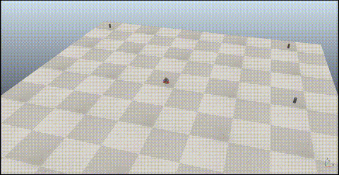
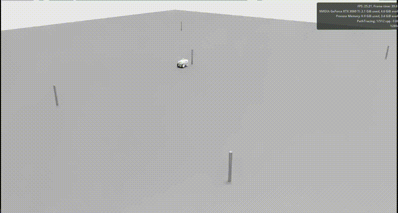

# Explicit Path Tracking for Pioneer 3DX

This section contains a **ROS 2 Humble** implementation of an explicit path tracking controller for a **Pioneer 3DX** differential drive robot. This practice was developed as part of the **Advanced Robotics** subject in the fourth year of the **Electronic, Robotic, and Mechatronic Engineering** degree at the **University of Málaga (UMA)**.

## Overview
The core of this project is a point-to-point navigation system. The robot follows a sequence of predefined waypoints by calculating real-time control laws for linear velocity ($v$) and angular velocity ($\omega$). By transforming global coordinates to the robot's local frame, the controller ensures smooth transitions and heading correction through a proportional control loop.

* **Kinematics (Wheel base & radius):** Modify `seg_tray/config/nav_params.yaml`
* **ROS 2 Topics (Publisher & Subscriber):** Modify `seg_tray/src/nav_p2p.cpp`

---

### 1. CoppeliaSim (Pioneer 3DX)
The original legacy environment used for initial development.
* **Kinematics:** Wheel base of **0.331 m**, Wheel radius of **0.0975 m**.
* **ROS 2 Topics:** `/PioneerP3DX/cmd_vel` and `/PioneerP3DX/odom`.

---

### 2. NVIDIA Isaac Sim (Nova Carter)
*Note: This scene was created purely for educational purposes to learn Omniverse and PhysX integration.*
* **Kinematics:** Wheel base of **0.4132 m**, Wheel radius of **0.14 m**.
* **ROS 2 Topics:** Standard `/cmd_vel` and `/odom`.

#### Official NVIDIA References Used for this Integration:
* [NVIDIA USD Robot Assets (Nova Carter)](https://docs.omniverse.nvidia.com/isaacsim/latest/features/environment_setup/assets/usd_assets_robots.html)
* [NVIDIA Isaac Sim ROS 2 Bridge Architecture](https://docs.omniverse.nvidia.com/isaacsim/latest/ros2_tutorials/index.html)
