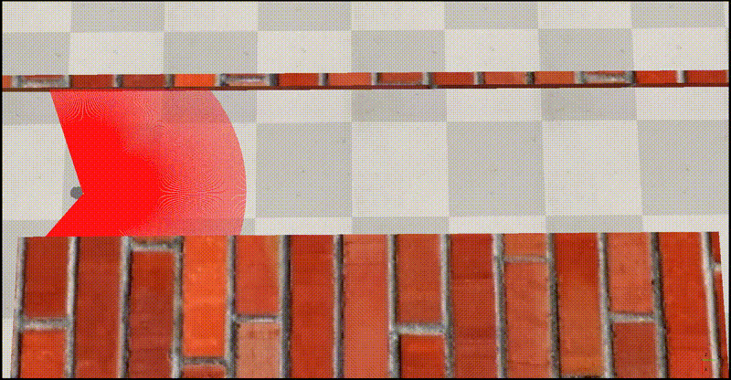
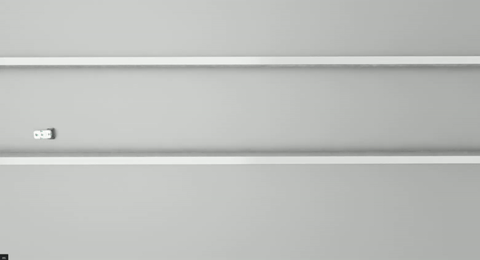

# Implicit Path Tracking & Corridor Navigation

This section contains a **ROS 2 Humble** implementation of an implicit path tracking controller for a **Pioneer 3DX** differential drive robot. This practice was developed as part of the **Advanced Robotics** subject in the fourth year of the **Electronic, Robotic, and Mechatronic Engineering** degree at the **University of Málaga (UMA)**.

## Overview
Unlike explicit navigation using predefined waypoints, this project focuses on environment-driven navigation. The robot dynamically calculates its position inside a corridor using a 2D LiDAR scanner and maintains a center-line trajectory using a **Pure Pursuit** control algorithm. 

*Note: The base node structure, ROS 2 topic subscriptions, and raw laser parsing functions were provided by the UMA teaching staff. My specific contributions to this module include:*
1. **The Pure Pursuit Controller:** Implementation of the control loop.
2. **Emergency Stop Service:** Design and implementation of a synchronous ROS 2 Service Server (`/emergency_stop`) that allows external clients to halt the robot when frontal obstacles are critically close.

---

### 1. CoppeliaSim (Pioneer 3DX)
The original simulation environment used to validate the lateral controller and the client-server architecture.
* **Kinematics:** Wheel base of **0.331 m**, Wheel radius of **0.0975 m**.
* **ROS 2 Topics:** `/PioneerP3DX/cmd_vel`, `/PioneerP3DX/odom` and `/PioneerP3DX/laser_scan`.
* **ROS 2 Services:** `/emergency_stop` (Type: `std_srvs/srv/Trigger`).

---

### 2. NVIDIA Isaac Sim (Nova Carter)
This scene was created primarily to learn **Isaac Sim** and become more familiar with its simulation environment and tools.
* **Kinematics:** Wheel base of **0.4132 m**, Wheel radius of **0.14 m**. Corridor width configured to **3.70 m**.
* **ROS 2 Topics:** Standard `/scan`, `/cmd_vel` and `/odom`.
* **ROS 2 Services:** `/emergency_stop` (Type: `std_srvs/srv/Trigger`).

#### Official NVIDIA Documentation & References Used:
* **RTX Lidar & Render Products Architecture:** [NVIDIA Isaac Sim - ROS 2 RTX Lidar Sensors](https://docs.omniverse.nvidia.com/isaacsim/latest/ros2_tutorials/tutorial_ros2_rtx_lidar.html)
* **Differential Base Control & ROS 2 Bridge:** [NVIDIA Isaac Sim - Driving a Robot (ROS 2)](https://docs.omniverse.nvidia.com/isaacsim/latest/ros2_tutorials/tutorial_ros2_drive_turtlebot.html)
* **Nova Carter USD Assets & Specifications:** [NVIDIA Isaac Sim - Omniverse USD Robot Assets](https://docs.omniverse.nvidia.com/isaacsim/latest/features/environment_setup/assets/usd_assets_robots.html)