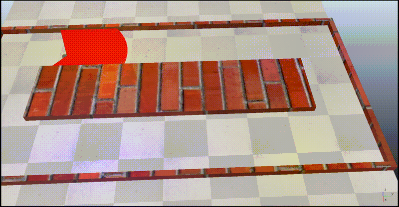

# Implicit Path Tracking & Corridor Navigation

This section contains a **ROS 2 Humble** implementation of an implicit path tracking controller for a **Pioneer 3DX** differential drive robot. This practice was developed as part of the **Advanced Robotics** subject in the fourth year of the **Electronic, Robotic, and Mechatronic Engineering** degree at the **University of Málaga (UMA)**.

## Overview
Unlike explicit navigation using predefined waypoints, this project focuses on environment-driven navigation. The robot dynamically calculates its position inside a corridor using a 2D LiDAR scanner and maintains a center-line trajectory using a **Pure Pursuit** control algorithm. 

*Note: The base node structure, ROS 2 topic subscriptions, and raw laser parsing functions were provided by the UMA teaching staff. My specific contributions to this module include:*
1. **The Pure Pursuit Controller:** Implementation of the control loop.
2. **Emergency Stop Service:** Design and implementation of a synchronous ROS 2 Service Server (`/emergency_stop`) that allows external clients to halt the robot when frontal obstacles are critically close.

* **Parameters (Corridor width, Look-ahead distance, Limits):** Modify `seg_tray/config/corr_params.yaml`

### 1. CoppeliaSim (Pioneer 3DX)
The simulation environment used to validate the lateral controller and the client-server architecture.
* **Sensors used:** `/PioneerP3DX/laser_scan` (to compute lateral distance and frontal collision warnings).
* **ROS 2 Topics:** `/PioneerP3DX/cmd_vel` and `/PioneerP3DX/odom`.
* **ROS 2 Services:** `/emergency_stop` (Type: `std_srvs/srv/Trigger`).

#### Official Industrial References for this Architecture:
* [NVIDIA Isaac Sim - ROS 2 Services and Client-Server Architecture](https://docs.omniverse.nvidia.com/isaacsim/latest/ros2_tutorials/tutorial_ros2_services.html)
* [NVIDIA Isaac Sim - Advanced PhysX Debugging & Invalid Transforms (NaN Protection)](https://docs.omniverse.nvidia.com/isaacsim/latest/advanced_tutorials/tutorial_advanced_physx_debugging.html)