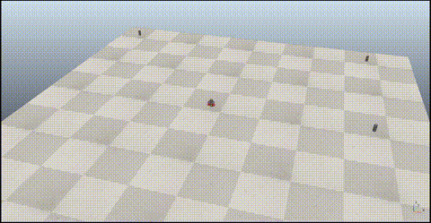

# Explicit Path Tracking for Pioneer 3DX

This section contains a **ROS 2 Humble** implementation of an explicit path tracking controller for a **Pioneer 3DX** differential drive robot. This practice was developed as part of the **Advanced Robotics** subject in the fourth year of the **Electronic, Robotic, and Mechatronic Engineering** degree at the **University of Málaga (UMA)**.

## Overview
The core of this project is a point-to-point navigation system. The robot follows a sequence of predefined waypoints by calculating real-time control laws for linear velocity ($v$) and angular velocity ($\omega$). By transforming global coordinates to the robot's local frame, the controller ensures smooth transitions and heading correction through a proportional control loop.

### Key Technical Details:
* **Kinematics**: Differential drive model with a wheel track of **0.331 m** and wheel radius of **0.0975 m**.
* **Control**: Proportional heading control with a constant linear velocity of **1.2 m/s**.
* **Logic**: Automatic waypoint switching upon entering a **1.0-meter** acceptance radius.